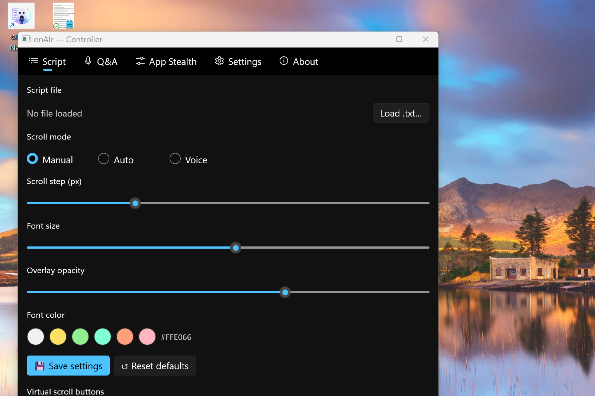

# onAIr Native

**onAIr Native** is a transparent, always-on-top teleprompter overlay for Windows — built with **WinUI 3 / C#** as a native spinoff of [onAIr v1.3.0 (Electron)](https://github.com/souz4rafael/onair).

Load a presentation script, keep it floating above your screen share, and use AI to capture and answer client questions in real time. Now with faster in-process Whisper transcription, bulletproof WASAPI audio, and a unique **App Stealth** container to hide any running app from screen capture.

**Authors:** Rafael Souza (Microsoft) · GitHub Copilot (Claude Sonnet 4.6)

---

## Why native?

| Feature | Electron v1.3 | onAIr Native |
|---|---|---|
| Transcription | Whisper via cloud API subprocess | **whisper.net in-process** (~10× faster) |
| Audio capture | WebView2 sandbox (unreliable loopback) | **NAudio WASAPI** (mic + system audio) |
| Global hotkeys | electron-globalShortcut (occasionally fails) | **Win32 RegisterHotKey** (bulletproof) |
| Content protection | Electron setContentProtection | **Win32 SetWindowDisplayAffinity** |
| App Stealth | — | **Embed any Win32 app** in a stealth container |
| Install size | ~150 MB | ~80 MB |
| Cold start | ~4 s | ~1 s |

---

## Screenshots

### Controller — Script controls

[](OnAirNative/Assets/screenshots/screenshot-controller-script.png)

_The Controller is your presenter dashboard. Choose scroll mode (Manual / Auto / Voice), adjust font size and opacity, pick a font color, and load your `.txt` script. Large ▲▼ buttons are touch-friendly for a secondary screen._

---

### Controller — Q&A recording

[](OnAirNative/Assets/screenshots/screenshot-controller-qa.png)

_Press **● Record** (or `Ctrl+Alt+R`) to capture a client question. onAIr transcribes it via Whisper and sends it to your chosen AI provider. The answer appears in the overlay instantly. Configure chat + transcription providers independently._

---

### Controller — App Stealth

[](OnAirNative/Assets/screenshots/screenshot-controller-stealth.png)

_Select any running Win32 app from the list and click **⊕ Embed in container**. The app is re-parented into a `WDA_EXCLUDEFROMCAPTURE` container — you can interact with it normally, but the client sees nothing during screen share. Ideal for hiding reference notes, internal docs, or pricing tools._

---

### Controller — Settings

[](OnAirNative/Assets/screenshots/screenshot-controller-settings.png)

_Choose your audio input device (for recording and voice scroll), configure the voice scroll sensitivity threshold, and see the mic level indicator in real time._

---

## Features

### Overlay
- **Transparent, frameless, always-on-top** — WinUI 3 + DWM compositor
- **Hidden from screen share by default** — `SetWindowDisplayAffinity(WDA_EXCLUDEFROMCAPTURE)`
- **Click-through mode** — keyboard and mouse pass to the window underneath; toggle with `Ctrl+Alt+Home`
- **Mode label** in header — shows current mode (Script / Q&A); no clickable pills to distract
- **Starts hidden** — only the Controller opens on launch; show the overlay when you're ready

### Script / Teleprompter
- Load any `.txt` file from the Controller or via `Ctrl+Alt+O`
- **Manual scroll** — `Ctrl+Alt+PgUp / PgDn` (global, works even when Teams has focus)
- **Auto-scroll** — continuous smooth scroll at configurable speed
- **Voice-activated scroll** — microphone RMS detection; scroll sensitivity adjustable in Settings
- **Font color presets** — White, Yellow, Green, Aqua, Orange, Pink — saved to config

### Q&A mode
- **Record** from the Controller's Q&A tab (or `Ctrl+Alt+R`)
- **Whisper transcription** — in-process via `whisper.net` (fast, no subprocess) or cloud API
- **AI answer** — sent to your chosen LLM; displayed in the overlay
- **6 chat providers** — Azure OpenAI · OpenAI · Groq · Anthropic Claude · Google Gemini · Mistral
- **Split providers** — use Groq for Whisper, Anthropic for chat, for example
- **System prompt + presentation context** — customise tone, language, persona per session

### Controller window
- **Script tab**: file picker, scroll mode, sliders, font color, save/reset settings, virtual ▲▼ buttons
- **Q&A tab**: record button, status, provider selection, credential config, system prompt, Whisper model
- **App Stealth tab**: embed any Win32 window in a stealth container
- **Settings tab**: audio device selection, voice scroll sensitivity, threshold visualiser
- **About tab**: version, hotkey reference, GitHub link
- **Footer**: `👁 Overlay: visible/hidden` · `🔒 Overlay: locked/unlocked` · `🙈 Hide from capture`

### App Stealth container
- Enumerate all visible windows (`EnumWindows`)
- Re-parent the selected window into a `WDA_EXCLUDEFROMCAPTURE` Win32 container
- Container has title bar, close button, and resize borders
- Embedded app runs normally — fully interactive
- Restores the window to its original state on release or app close

---

## Build prerequisites

1. **.NET 8 SDK** (x64) — [download](https://dotnet.microsoft.com/download)
2. **Windows 10 version 2004** (build 19041) or later — required for WinUI 3 and `WDA_EXCLUDEFROMCAPTURE`

```powershell
git clone https://github.com/souz4rafael/onair-native.git
cd onair-native

dotnet restore OnAirNative/OnAirNative.csproj
dotnet build   OnAirNative/OnAirNative.csproj -c Release
```

Run the output at:
```
OnAirNative/bin/Release/net8.0-windows10.0.19041.0/OnAirNative.exe
```

> **VS Code:** install the [C# Dev Kit](https://marketplace.visualstudio.com/items?itemName=ms-dotnettools.csdevkit) extension and open the repo folder. Use `Ctrl+Shift+B` to build.

---

## AI setup

Open **Controller → Q&A tab** → choose a provider → click **⚙ Configure provider…**

### Chat providers

| Provider | Where to get a key | Cost |
|---|---|---|
| **Azure OpenAI** | Azure Portal → your resource → Keys and Endpoint | Pay-per-use |
| **OpenAI** | [platform.openai.com](https://platform.openai.com) → API Keys | Pay-per-use |
| **Groq** | [console.groq.com](https://console.groq.com) → API Keys | **Free tier** |
| **Anthropic Claude** | [console.anthropic.com](https://console.anthropic.com) | Pay-per-use |
| **Google Gemini** | [aistudio.google.com](https://aistudio.google.com) | Free tier |
| **Mistral** | [console.mistral.ai](https://console.mistral.ai) | Pay-per-use |

### Transcription providers (Whisper)

Azure OpenAI, OpenAI and Groq support the Whisper API. If you use Anthropic/Gemini/Mistral for chat, set a separate transcription provider.

**Groq is the easiest way to start** — free tier, no credit card.

---

## Whisper local model (optional)

For fully in-process, offline transcription, download a `.gguf` / `.bin` model from  
[huggingface.co/ggerganov/whisper.cpp](https://huggingface.co/ggerganov/whisper.cpp):

| Model | Size | Notes |
|---|---|---|
| `ggml-base.en.bin` | ~142 MB | Fastest, English only |
| `ggml-small.en.bin` | ~244 MB | Balanced |
| `ggml-medium.bin` | ~1.5 GB | Best accuracy, multilingual |

Set the path in **Controller → Q&A → Whisper local model path**.  
Leave blank to use the cloud API.

---

## Configuration

Settings are saved to `%LocalAppData%\onAIr Native\config.json`.  
Format is compatible with the Electron app's `config.json` — you can copy credentials across.

---

## Keyboard shortcuts

All shortcuts are **global** — they work even when Teams, PowerPoint or Edge has focus.

| Shortcut | Action |
|---|---|
| `Ctrl+Alt+PgUp` | Scroll script up |
| `Ctrl+Alt+PgDn` | Scroll script down |
| `Ctrl+Alt+Home` | Toggle Move Mode (drag/resize overlay) |
| `Ctrl+Alt+R` | Start / stop Q&A recording |
| `Ctrl+Alt+M` | Cycle overlay mode (Script ↔ Q&A) |
| `Ctrl+Alt+O` | Open script file picker |

---

## Project structure

```
onair-native/
├── OnAirNative.sln
└── OnAirNative/
    ├── OnAirNative.csproj          WinUI 3, unpackaged, x64, net8.0-windows10.0.19041.0
    ├── App.xaml / App.xaml.cs      Entry point, service wiring, hotkey dispatch
    ├── Win32/NativeMethods.cs      P/Invoke (SetWindowDisplayAffinity, RegisterHotKey,
    │                               EnumWindows, SetParent, Shell_NotifyIcon, …)
    ├── Models/AppConfig.cs         Root config model (6 providers + appearance + window state)
    ├── Services/
    │   ├── ConfigService.cs        JSON persistence to %LocalAppData%
    │   ├── WindowService.cs        Win32 transparency / click-through / always-on-top
    │   ├── HotkeyService.cs        RegisterHotKey on background thread + message loop
    │   ├── AudioService.cs         NAudio WASAPI mic + loopback, RMS voice monitor
    │   ├── WhisperService.cs       whisper.net in-process + cloud API fallback
    │   ├── AiChatService.cs        6 AI providers via HttpClient
    │   ├── TrayService.cs          Shell_NotifyIcon system tray + context menu
    │   ├── StealthWindowService.cs EnumWindows window list + SetWindowDisplayAffinity
    │   └── WindowEmbedService.cs   SetParent window embedding in stealth container
    ├── ViewModels/                 MVVM via CommunityToolkit.Mvvm
    │   ├── OverlayViewModel.cs     Script, Q&A, scroll modes, recording
    │   ├── ControllerViewModel.cs  Tab sub-VM orchestrator
    │   ├── ScrollTabViewModel.cs   Scroll settings, file loading, opacity/font
    │   ├── AiTabViewModel.cs       Provider selection, credentials, test connection
    │   └── AboutTabViewModel.cs    Version, authors, GitHub link
    ├── Views/
    │   ├── OverlayWindow.xaml      Transparent overlay (mode label, Script + Q&A panels)
    │   ├── ControllerWindow.xaml   Controller (5 tabs + footer)
    │   └── Dialogs/
    │       └── ProviderConfigDialog.xaml   Credential editor per provider
    └── Assets/
        ├── app-icon.ico            App + tray icon
        └── screenshots/            README screenshots
```

---

## License

MIT — same as [onAIr v1.3.0](https://github.com/souz4rafael/onair/blob/master/LICENSE).
