# onAIr

**onAIr** is a transparent, always-on-top teleprompter for Windows, built with **WinUI 3 / C#**.

Load a presentation script into the **TP** — a transparent floating window — keep it visible above
your screen share, and use AI to capture and answer client questions in real time. Fast in-process
Whisper transcription, bulletproof WASAPI audio, a card-based Controller UI with a System/Light/Dark
theme, in-app auto-update, and a unique **App Stealth** container to hide any running app from
screen capture.

**Authors:** Rafael Souza (Microsoft) · GitHub Copilot (Claude Sonnet 4.6)

---

## Screenshots

### Controller — Script

[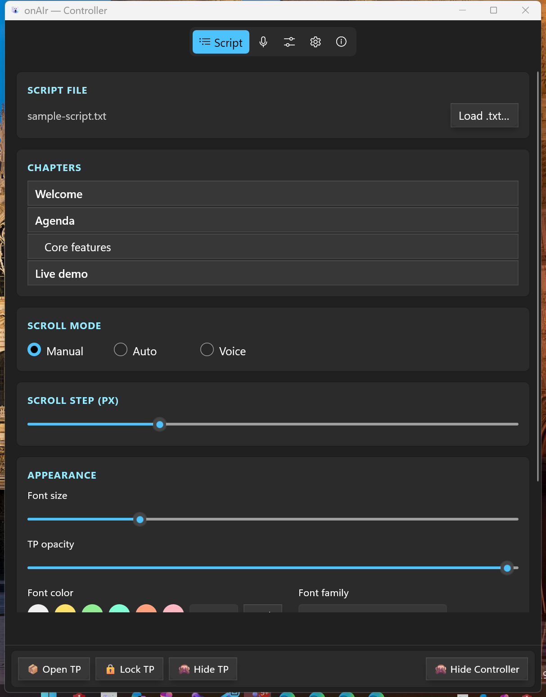](OnAirNative/Assets/screenshots/screenshot-controller-script.png)

_The Controller is your presenter dashboard. Every tab is organised into cards, selected via a
segmented pill tab bar (Script · Q&A · AI Insights · Settings · App Stealth · About). Load your
`.txt` script — headings (`#`/`##`) automatically populate a **CHAPTERS** card for one-click
navigation. Choose scroll mode (Manual / Auto / Voice — only the active mode's speed control is
shown), adjust font size and TP opacity, and pick a font color. Large ▲▼ buttons are touch-friendly
for a secondary screen. The footer's TP controls (**Open TP** · **Lock TP** · **Hide TP**) sit on
the left, **Hide Controller** on the right._

---

### Controller — Q&A recording

[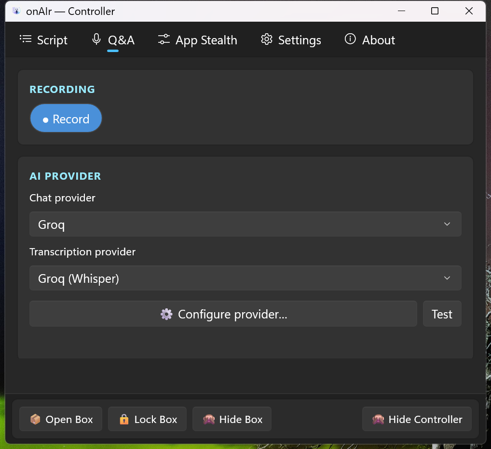](OnAirNative/Assets/screenshots/screenshot-controller-qa.png)

_Press **● Record** (or `Ctrl+Alt+R`) to capture a client question. onAIr transcribes it via Whisper
and sends it to your chosen AI provider. The answer appears in the TP instantly. Configure chat +
transcription providers independently. The **Glossary** field (product names, jargon, acronyms)
biases both Whisper transcription and the AI's answers toward your exact terminology._

---

### Controller — Knowledge base & conversation memory

[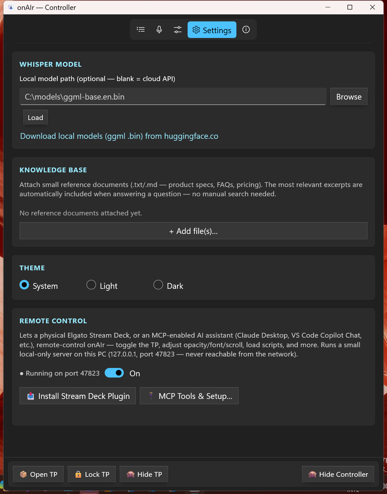](OnAirNative/Assets/screenshots/screenshot-controller-knowledgebase.png)

_Attach small `.txt`/`.md` reference documents — product specs, FAQs, pricing — and onAIr
automatically searches them for relevant excerpts when answering a question. No embeddings/vector
database, no extra AI call: a lightweight, instant, local relevance search. The **Conversation
memory** card below it holds the last 6 Q&A turns used as context for follow-ups — click **View
conversation** for a read-only popup of the full history, or **Clear** to reset it._

---

### Controller — AI Insights (window controls & appearance)

[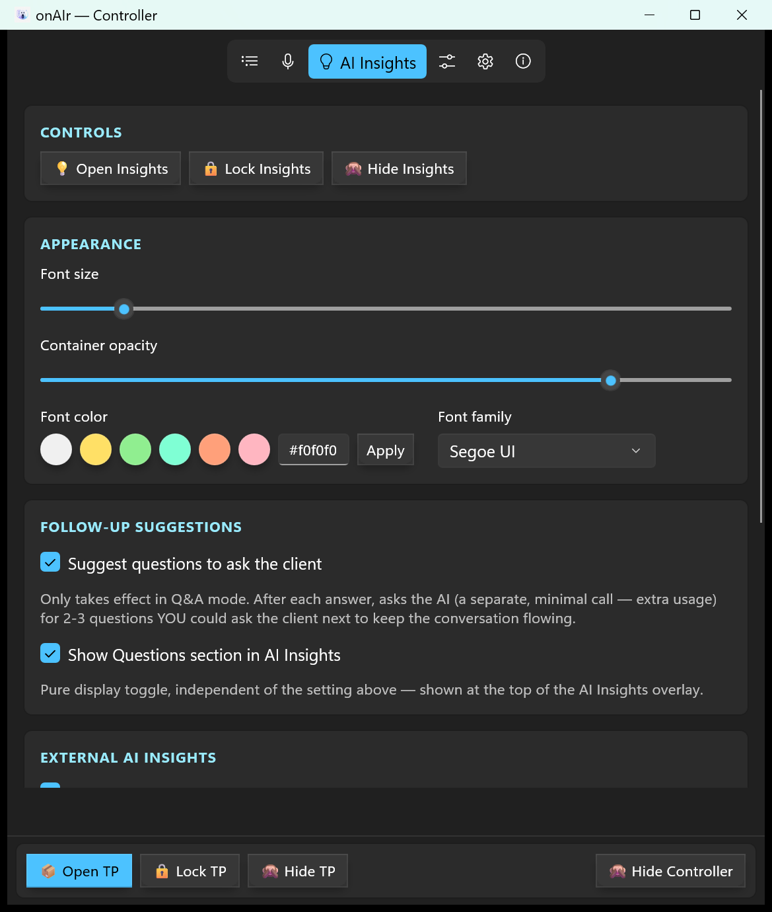](OnAirNative/Assets/screenshots/screenshot-controller-insights.png)

_Open, lock, or hide-in-share the separate AI Insights window from here, and tune its appearance
(font size, opacity, font family, color) completely independently of the TP's own appearance
settings — see [AI Insights window](#ai-insights-window) below._

---

### Controller — AI Insights (section toggles)

[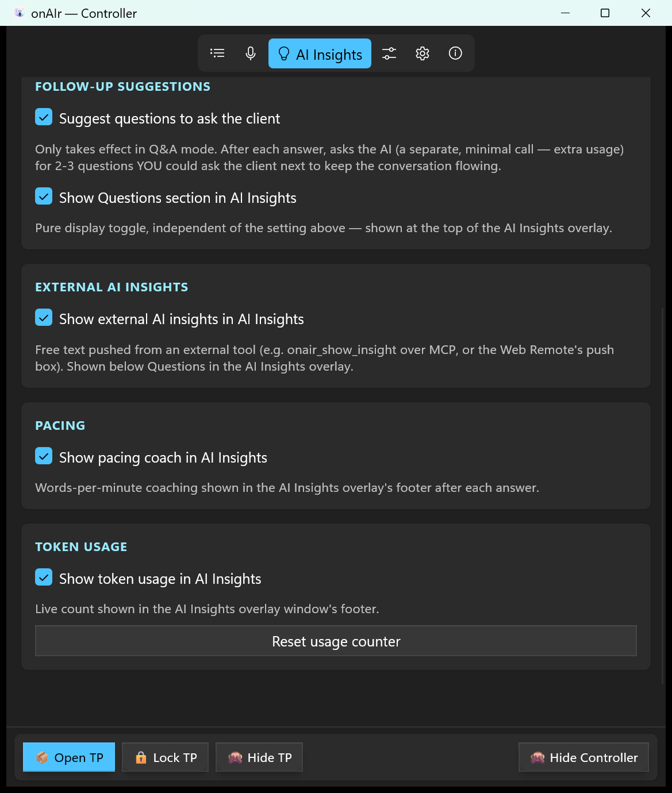](OnAirNative/Assets/screenshots/screenshot-controller-insights-toggles.png)

_Four independent on/off switches — **Questions** (follow-up suggestions, active in Q&A mode),
**External AI Insights**, **Pacing**, and **Token Usage** — control which of the AI Insights
window's four sections are shown, in the same top-to-bottom order they appear in the window itself._

---

### Controller — Settings

[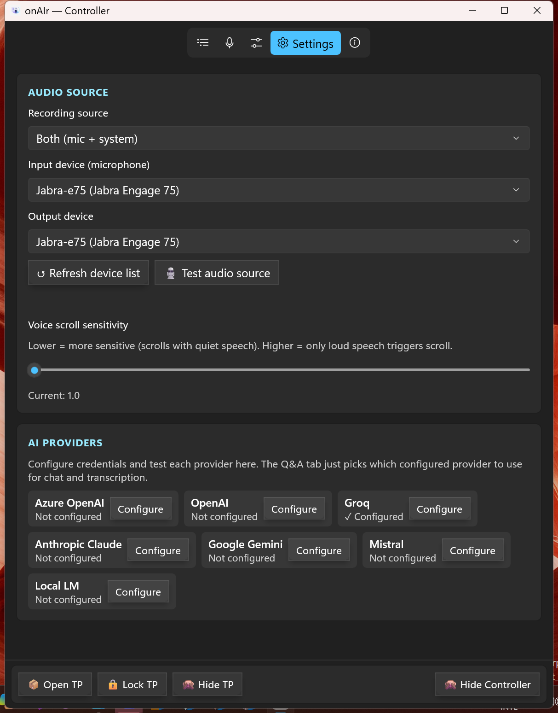](OnAirNative/Assets/screenshots/screenshot-controller-settings.png)

_Choose your audio input device (for recording and voice scroll), configure the voice scroll
sensitivity threshold, and manage all 7 AI providers — including **Local LM** for self-hosted
servers like Ollama or LM Studio._

---

### Controller — Settings (theme & remote control)

[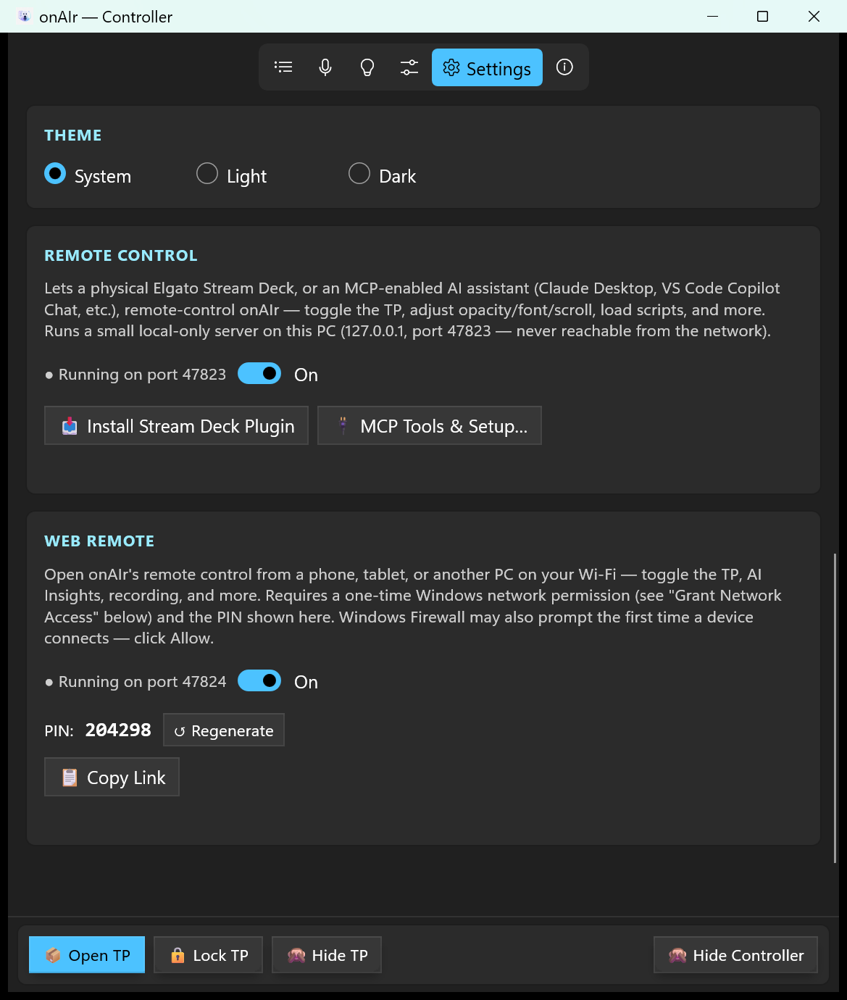](OnAirNative/Assets/screenshots/screenshot-controller-settings-remote.png)

_Pick a **System / Light / Dark** theme — applies instantly, no restart needed. The **Remote
Control** card toggles the local Stream Deck/MCP WebSocket server and links to the MCP tools dialog.
The **Web Remote** card enables a PIN-protected browser control surface reachable from your phone or
tablet on the same Wi-Fi — see [Web Remote](#web-remote-browser-control) below._

---

### Controller — App Stealth

[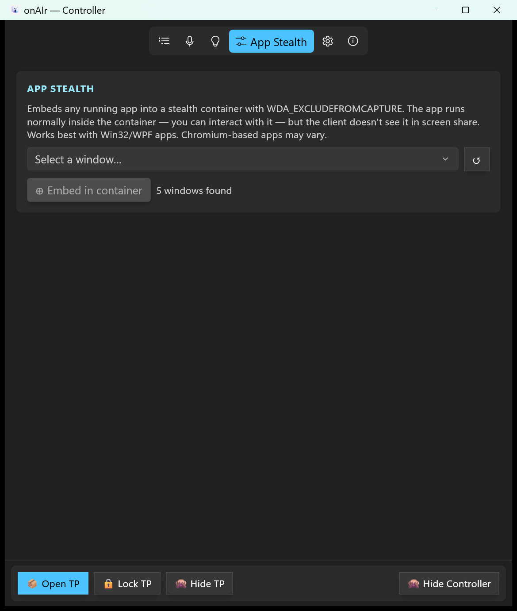](OnAirNative/Assets/screenshots/screenshot-controller-stealth.png)

_Select any running Win32 app from the list and click **⊕ Embed in container**. The app is
re-parented into a `WDA_EXCLUDEFROMCAPTURE` container — you can interact with it normally, but the
client sees nothing during screen share. Ideal for hiding reference notes, internal docs, or pricing
tools._

---

### Controller — About

[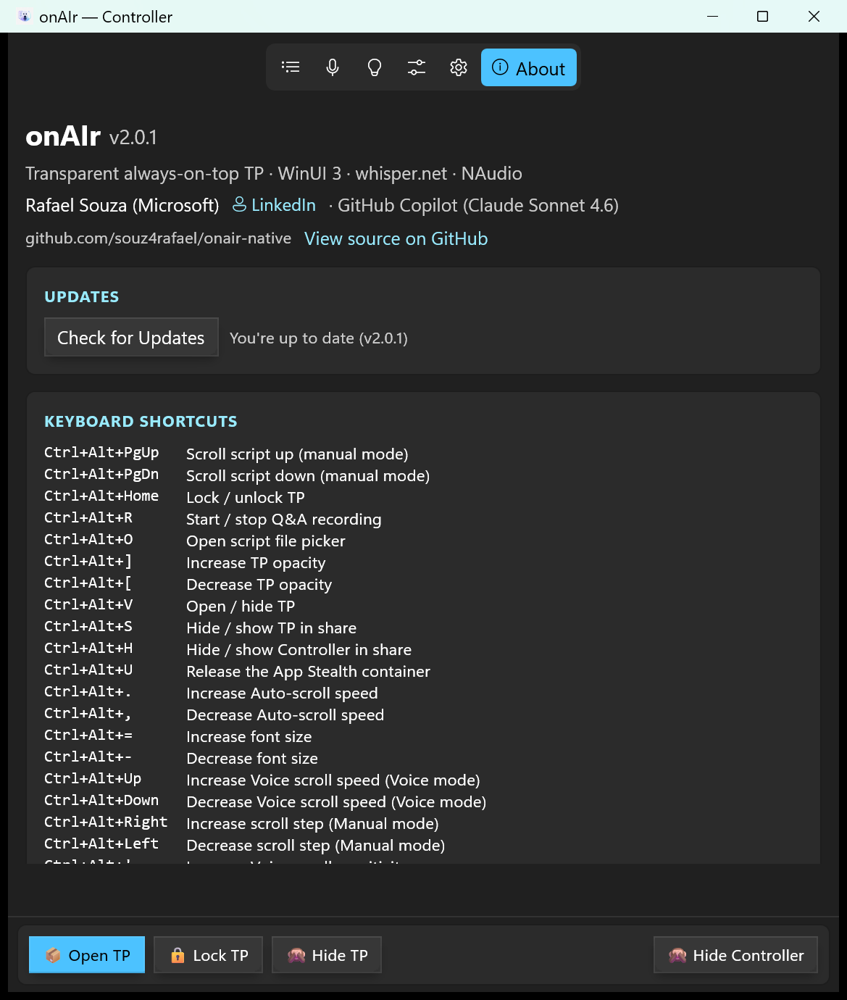](OnAirNative/Assets/screenshots/screenshot-controller-about.png)

_Version info, **Check for Updates** with one-click install, and the full global keyboard shortcut
reference._

---

### Local LM provider setup

[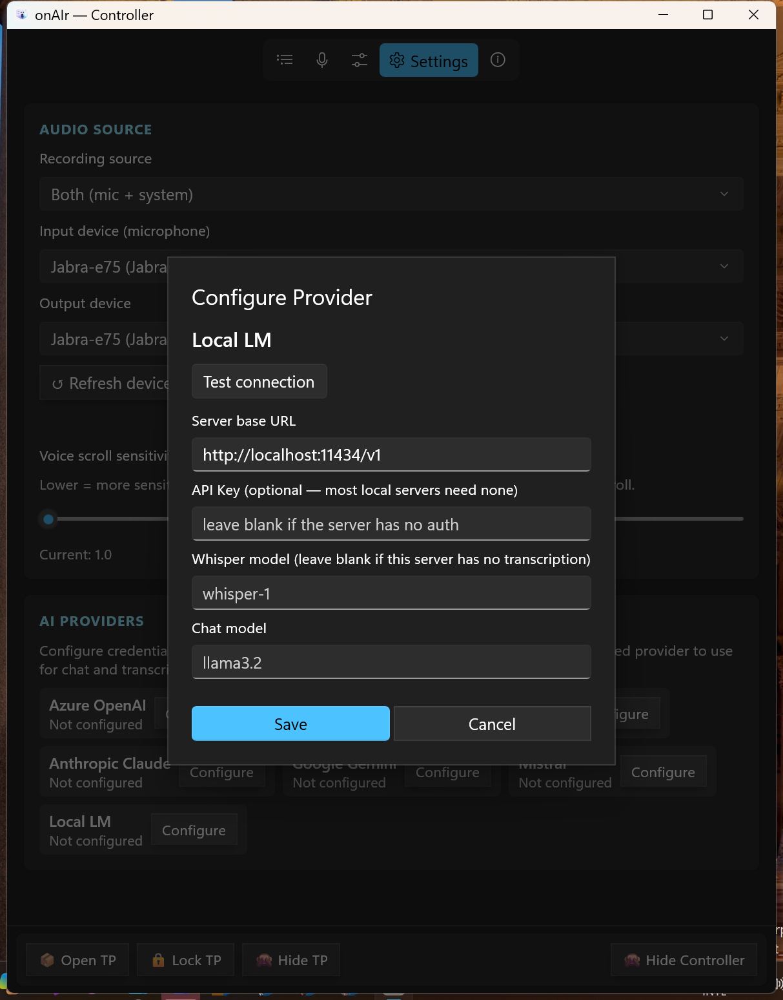](OnAirNative/Assets/screenshots/screenshot-local-lm-dialog.png)

_One config serves BOTH chat and transcription for a self-hosted server (Ollama, LM Studio,
llama-server, LocalAI) — set a Chat model, a Whisper model, or both, depending on what your server
supports. See the [Local LLM](#local-llm-ollama--lm-studio--self-hosted-incl-over-your-network)
chapter below for full setup steps, including reaching a server on another PC on your network._

---

### The TP

[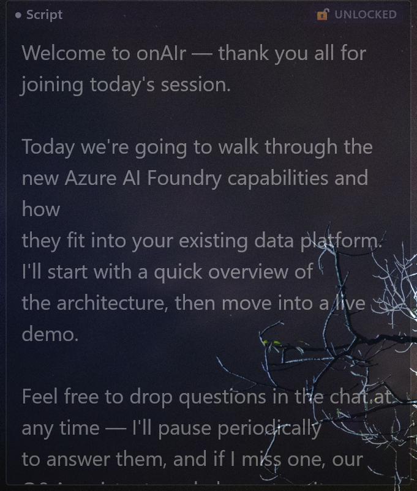](OnAirNative/Assets/screenshots/screenshot-box.png)

_The TP is the transparent, always-on-top window your script scrolls in. It floats above any app —
including a shared screen or recording — while staying invisible to viewers by default._

---

### AI Insights window (overlay)

[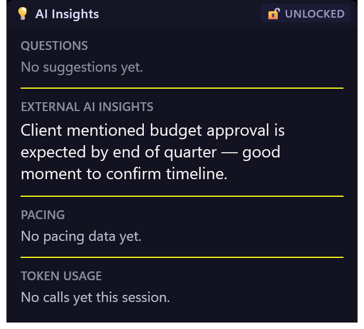](OnAirNative/Assets/screenshots/screenshot-ai-insights-overlay.png)

_A separate, freely resizable overlay — open it alongside the TP at the same time. Four sections,
each independently toggleable: follow-up **Questions**, **External AI Insights** (pushed by an MCP
client via `onair_show_insight`), **Pacing**, and **Token Usage**. See
[AI Insights window](#ai-insights-window) below for the full picture._

---

### Web Remote (screenshots)

[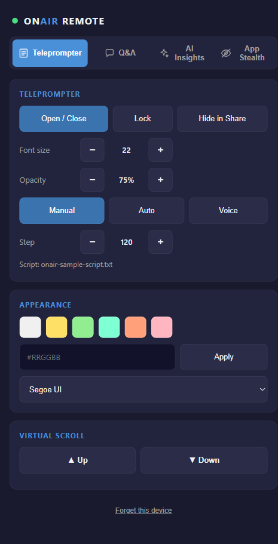](OnAirNative/Assets/screenshots/screenshot-webremote-teleprompter.png)
[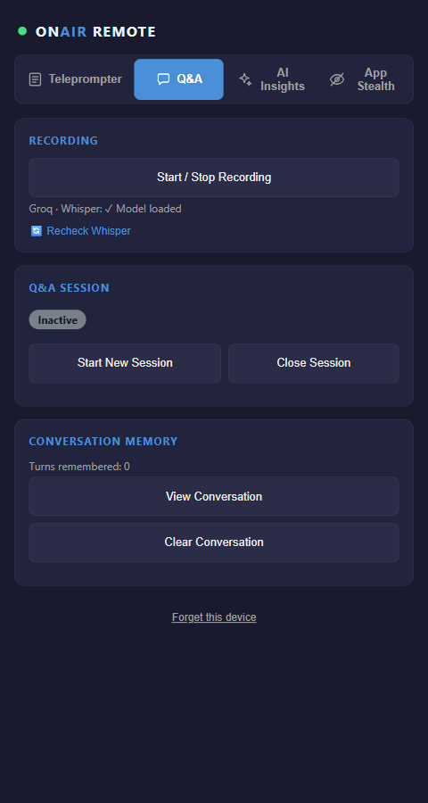](OnAirNative/Assets/screenshots/screenshot-webremote-qa.png)
[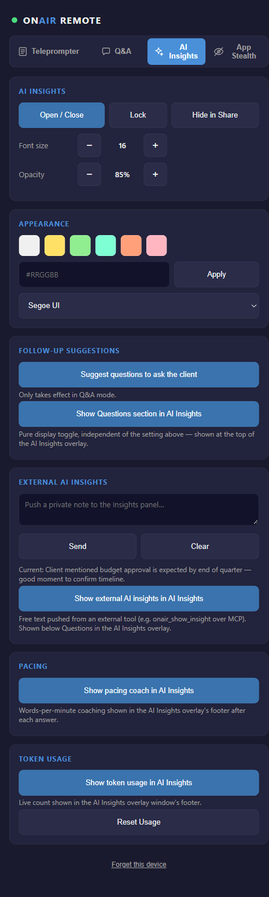](OnAirNative/Assets/screenshots/screenshot-webremote-insights.png)
[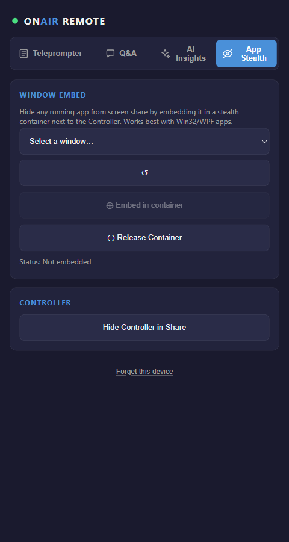](OnAirNative/Assets/screenshots/screenshot-webremote-stealth.png)

_A mobile-friendly control page — enable it in Settings → WEB REMOTE, then browse to
`http://<your-pc-ip>:<port>` from any phone/tablet on the same Wi-Fi and enter the PIN. Four tabs
mirror the Stream Deck/MCP capabilities: Teleprompter, Q&A, AI Insights (same 4 section toggles as
the Controller), and App Stealth. See [Web Remote](#web-remote-browser-control) below._

---

## Features

### The TP
- **Transparent, frameless, always-on-top** — WinUI 3 + DWM compositor
- **Hidden from screen share by default** — `SetWindowDisplayAffinity(WDA_EXCLUDEFROMCAPTURE)`;
  toggle it off from the Controller footer's **Hide TP** button to let viewers of your shared
  screen/recording see it too
- **Click-through mode** — keyboard and mouse pass to the window underneath; toggle with the
  footer's **Lock TP** button or `Ctrl+Alt+Home`
- **Mode label** in header — shows current mode (Script / Q&A); no clickable pills to distract
- **Always reopens at the top-left corner (0,0)** on app launch, so it's never lost off-screen on a
  disconnected or rearranged multi-monitor setup — moving/hiding/showing it within a session still
  keeps its last position
- **Starts hidden** — only the Controller opens on launch; show the TP with **Open TP** when
  you're ready

### Script / Teleprompter
- Load any `.txt` file from the Controller or via `Ctrl+Alt+O`
- **Chapters** — `#`/`##` Markdown headings in your script automatically populate a **CHAPTERS**
  card in the Controller; click any chapter to jump the TP straight to it (indented sub-levels for
  `##`) — a plain script with no headings simply shows no chapters card
- **Manual scroll** — `Ctrl+Alt+PgUp / PgDn`, step size tunable in the Controller (global, works
  even when Teams has focus), plus large ▲▼ **virtual scroll buttons** for touch-friendly control
  from a secondary screen or tablet
- **Auto-scroll** — continuous smooth scroll; speed tunable in the Controller or via `Ctrl+Alt+. / ,`
- **Voice-activated scroll** — real voice-activity detection (attack/release hysteresis, not a
  raw instantaneous level compare) with its own independent speed control (separate from
  Auto-scroll speed); sensitivity/threshold adjustable in Settings
- **Only the active scroll mode's control is shown** — Manual/Auto/Voice each get their own
  dedicated speed control in the Controller instead of all three competing for space
- **Font size** — tunable in the Controller or via `Ctrl+Alt+= / -`, applies live to the TP
- **TP opacity** — tunable in the Controller or via `Ctrl+Alt+] / [`
- **Font color presets** — White, Yellow, Green, Aqua, Orange, Pink, or a custom hex value — saved
  to config
- **Font family picker** — any font installed on your system, applies live to the TP
- **Save/Reset settings** — persist the current Appearance values, or restore the shipped defaults

### Q&A mode
- **Record** from the Controller's Q&A tab (or `Ctrl+Alt+R`)
- **Three capture sources** — microphone only, system audio only (WASAPI loopback), or **both
  mixed** into a single 16 kHz mono track (exactly the format Whisper wants, so nothing is
  resampled twice)
- **Whisper transcription** — in-process via `whisper.net` (fast, no subprocess) or cloud API
- **Live preview** — while recording with a local Whisper model loaded, the TP shows a rolling,
  still-forming transcript of what you've said so far, a few seconds behind; see the model-size
  note below
- **AI answer** — sent to your chosen LLM; displayed in the TP
- **7 chat providers** — Azure OpenAI · OpenAI · Groq · Anthropic Claude · Google Gemini · Mistral · Local LM
- **Split providers** — use Groq for Whisper, Anthropic for chat, for example
- **System prompt + presentation context** — customise tone, language, persona per session
- **Max tokens per answer** — tunable slider (50-2000), controls answer length/cost
- **Glossary + knowledge base** — custom vocabulary biases both transcription and answers; small
  reference documents (.txt/.md) get automatically searched for relevant excerpts per question
- **Follow-up question suggestions** (optional toggle, Controller → AI Insights tab) — after each
  answer, a separate minimal AI call suggests 2-3 questions *you* could ask the client next to keep
  the conversation flowing; shown as plain text in the [AI Insights window](#ai-insights-window)'s
  **Questions** section, never on the TP, never clickable
- **Token usage counter** — running total of prompt/completion tokens for the session, shown in the
  AI Insights window's **Token Usage** section, with a one-click reset
- **Multi-turn conversation memory** — the last 6 Q&A turns are automatically included as context
  for follow-up questions (invisible on the TP — the AI remembers, you don't see the clutter); a
  **Clear conversation** button resets it
- **Q&A session recording** — explicit **Start new session** / **Close session** buttons write a
  live-appended Markdown transcript of every Q&A turn to disk; never automatic, and a new session
  never inherits anything from the previous one (a different client/conversation starts clean). A
  link opens the folder where saved sessions live — no in-app session browser
- **Pacing coach** — a rough words-per-minute estimate after each recorded question, based on
  actual speaking time (pauses excluded); presenter-side only, shown in the AI Insights window's
  **Pacing** section, never on the TP
- **Real-time monitoring + Copilot insights via MCP** — an external MCP agent can poll each Q&A
  turn as it completes (question, answer, pacing) and push a short coaching note that lands in
  **two** places at once: a small Copilot-insight footer on the TP itself (visible in both Script
  and Q&A modes, kept visually separate from the AI's own Q&A answer) and the **External AI
  Insights** section of the separate [AI Insights window](#ai-insights-window); see
  [Remote control](#remote-control-stream-deck--ai-assistants)

### Controller window
Every tab is organised into cards (bold, letter-spaced, accent-colored titles) that group related
controls instead of one long flat list, selected via a segmented "pill" tab bar (the active tab
shows icon+text and grows; the rest collapse to icon-only):
- **Script tab**: file picker, scroll mode, per-mode speed control, font size/TP opacity/color
  (click a preset swatch to load its hex into the editable custom-color box), font family picker,
  save/reset settings, virtual ▲▼ buttons
- **Q&A tab**: record button, AI provider selection + test connection, prompts (system prompt,
  presentation context, glossary, max tokens), knowledge base reference documents, conversation
  memory (**View conversation** popup + **Clear**), Q&A session recording (start/close + open
  folder)
- **AI Insights tab**: open/lock/hide-in-share the separate AI Insights window, its own appearance
  settings (font size, opacity, font family, color — independent from the TP's), and 4 on/off
  toggles (Questions, External AI Insights, Pacing, Token Usage) controlling which sections of that
  window are shown — see [AI Insights window](#ai-insights-window)
- **App Stealth tab**: embed any Win32 window in a stealth container
- **Settings tab**: audio device + capture source selection + live mic level test, voice scroll
  sensitivity, one card per AI provider (configure credentials and test each independently — see
  "AI providers" below), local Whisper model file (load/unload), System/Light/Dark theme picker,
  Remote Control (Stream Deck + MCP) toggle and setup, Web Remote (browser control) toggle and PIN
- **About tab**: version, hotkey reference, GitHub link, check-for-updates with one-click install
- **Single instance**: launching the app again just brings the existing Controller forward
- **Footer**: the 3 TP controls (**Open TP** · **Lock TP** · **Hide TP**) on the left, **Hide
  Controller** on the right

### AI Insights window
A second overlay window, completely separate from the TP — open both at once, resize/move each
independently, and control every aspect from the Controller's **AI Insights** tab (or Stream Deck /
MCP / Web Remote):
- **Independent window** — its own open/close, lock (click-through), and hide-from-screen-share
  states, none of which affect the TP
- **Own appearance** — font size, opacity, font family, and text color, tuned separately from the
  TP's appearance settings
- **Four sections, always in the same order**: **Questions** (follow-up suggestions, only
  populated in Q&A mode), **External AI Insights** (free text pushed by an MCP client via
  `onair_show_insight` — shows "No external AI insights yet" until then), **Pacing** (words-per-minute
  coach), **Token Usage** (running prompt/completion token total) — separated by dividing lines,
  each with its own empty-state placeholder
- **Each section independently toggleable** — hide any of the 4 without closing the whole window,
  from the Controller, Stream Deck, MCP, or Web Remote
- **Session name** shown in the window, matching what the Pacing and Token Usage sections already
  displayed before the window existed
- Built for the same real-time-monitoring workflow as the Copilot-insight TP footer (see
  [Q&A mode](#qa-mode) and [Remote control](#remote-control-stream-deck--ai-assistants)) but as a
  dedicated, resizable surface you can park on a second monitor

### AI providers
Configuring a provider's credentials is fully independent of which provider you're currently
*using* for chat or transcription — no more switching the chat dropdown just to edit a different
provider's key:
- **7 provider cards in Settings** (Azure OpenAI · OpenAI · Groq · Anthropic Claude · Google
  Gemini · Mistral · Local LM), each showing a configured/not-configured status and a **Configure**
  button that opens that provider's own credential editor + a **Test connection** button
- **Q&A tab just picks which ones to use** — two dropdowns (chat provider, transcription
  provider) plus a **Test connection** button for whichever is currently selected
- **Split providers** — e.g. Groq for chat, OpenAI for transcription — configure both
  independently in Settings, then pick each one in the Q&A tab's dropdowns

### App Stealth container
- Enumerate all visible windows (`EnumWindows`)
- Re-parent the selected window into a `WDA_EXCLUDEFROMCAPTURE` Win32 container
- Container has title bar, close button, and resize borders
- Embedded app runs normally — fully interactive
- Restores the window to its original state on release or app close

### Remote control (Stream Deck & AI assistants)
A local-only WebSocket server (Settings → REMOTE CONTROL, **on** by default — toggle to disable)
lets other apps on your PC control onAIr, never reachable from the network:
- **Elgato Stream Deck plugin** (`streamdeck-plugin/`) — 24 actions: toggle TP/lock/hide-in-share
  ×2/recording, an AI status tile, 4 momentary actions (release stealth, open file, scroll
  up/down), 6 dial-capable actions (opacity, font size, scroll speed ×2, scroll step, voice
  sensitivity), plus 8 AI Insights actions — open/lock/hide-in-share for the window itself, a
  Pacing status tile, and 4 on/off toggles for its Questions/External AI Insights/Pacing/Token
  Usage sections. Install via Settings → REMOTE CONTROL → **Install Stream Deck Plugin**.
- **MCP server** (`mcp-server/`) — lets any Model Context Protocol client (Claude Desktop, VS
  Code Copilot Chat, etc.) control onAIr with natural language: "open the teleprompter", "set the
  font color to blue", "load my demo script". 35 tools, each individually toggleable via
  Settings → REMOTE CONTROL → **MCP Tools & Setup…**, which also has a one-click **Copy MCP
  Config** button for registering the server with your AI client. Alongside the original TP/Q&A
  tools, a dedicated set controls the [AI Insights window](#ai-insights-window): open/lock/hide,
  its own appearance (font size/opacity/color/family), and a toggle per section
  (`onair_toggle_insights_show_questions/_external/_pacing/_token_usage`).
- **Q&A monitoring + Copilot insights** — an MCP client can poll `onair_get_state` (or the more
  focused `onair_get_last_qa_turn`) to watch onAIr's Q&A activity in real time: the transcribed
  question, the AI's answer, a `qaTurnCount` counter that increments once per completed round
  (compare it to the last value you saw to detect a new turn without re-reading the same one),
  the pacing summary, and follow-up suggestions — `onair_get_state` additionally reports the AI
  Insights window's own open/lock/hide state and which of its 4 sections are currently shown. This
  is the seam an EXTERNAL monitoring agent uses to watch a live presentation — cross-reference the
  question against other systems (CRM, docs, past emails) and react. `onair_show_insight` then
  pushes a short note that lands in **two** places at once: a small **Copilot-insight footer** on
  the TP itself (visible in BOTH Script and Q&A modes, deliberately separate from the AI's own Q&A
  answer so the presenter always knows "what to tell the client" apart from "a private heads-up
  from my copilot") and the **External AI Insights** section of the separate
  [AI Insights window](#ai-insights-window). Call `onair_clear_insight` to remove it. The "brain"
  that decides WHEN to surface an insight and what other data to cross-reference is entirely
  external to onAIr — these tools are only the collection + delivery mechanism.

### Web Remote (browser control)
A second, LAN-reachable remote surface alongside the loopback-only Stream Deck/MCP server — useful
for controlling onAIr from a phone or tablet while presenting, with no extra software to install on
that device:
- **Settings → WEB REMOTE** — off by default; enabling it starts a small HTTP/WebSocket server
  bound to all network interfaces (not just loopback) on a configurable port, serving a static
  mobile-friendly control page plus the same op vocabulary the Stream Deck plugin uses
- **PIN-protected** — every connection (page load and WebSocket upgrade) must present the current
  PIN shown in Settings; regenerating the PIN instantly revokes every already-connected device,
  with no server-side session store to clean up
- **Four tabs**, mirroring the Controller: **Teleprompter** (open/lock/hide, opacity, font size,
  scroll), **Q&A** (record, provider status), **AI Insights** (open/lock/hide the window plus the
  same 4 section toggles as the Controller's AI Insights tab), and **App Stealth** (list + embed
  windows — this and window listing are deliberately Web-Remote-exclusive, since they need a live
  list of the presenter's own desktop windows)
- **Windows networking** — reaching the server from another device requires either running onAIr
  elevated once, or a one-time `netsh http add urlacl` reservation (Settings → WEB REMOTE →
  **Grant Network Access** walks you through it); the static page itself needs no login, only the
  WebSocket upgrade is PIN-checked

---

## Build prerequisites

1. **.NET 8 SDK** (x64) — [download](https://dotnet.microsoft.com/download)
2. **Windows 10 version 2004** (build 19041) or later — required for WinUI 3 and
   `WDA_EXCLUDEFROMCAPTURE`

```powershell
git clone https://github.com/souz4rafael/onair-native.git
cd onair-native

dotnet restore OnAirNative/OnAirNative.csproj
dotnet build   OnAirNative/OnAirNative.csproj -c Release
```

Run the output at:
```
OnAirNative/bin/Release/net8.0-windows10.0.19041.0/OnAirNative.exe
```

> **VS Code:** install the [C# Dev Kit](https://marketplace.visualstudio.com/items?itemName=ms-dotnettools.csdevkit)
> extension and open the repo folder. Use `Ctrl+Shift+B` to build.

---

## AI setup

Open **Controller → Q&A tab** → choose a provider → click **⚙ Configure provider…**

### Chat providers

| Provider | Where to get a key | Cost |
|---|---|---|
| **Azure OpenAI** | Azure Portal → your resource → Keys and Endpoint | Pay-per-use |
| **OpenAI** | [platform.openai.com](https://platform.openai.com) → API Keys | Pay-per-use |
| **Groq** | [console.groq.com](https://console.groq.com) → API Keys | **Free tier** |
| **Anthropic Claude** | [console.anthropic.com](https://console.anthropic.com) | Pay-per-use |
| **Google Gemini** | [aistudio.google.com](https://aistudio.google.com) | Free tier |
| **Mistral** | [console.mistral.ai](https://console.mistral.ai) | Pay-per-use |
| **Local LM** | Self-hosted (Ollama/LM Studio/etc.) — see [Local LLM](#local-llm-ollama--lm-studio--self-hosted-incl-over-your-network) below | Free |

### Transcription providers (Whisper)

Azure OpenAI, OpenAI and Groq support the Whisper API. If you use Anthropic/Gemini/Mistral for
chat, set a separate transcription provider. **Local LM** (the same self-hosted server config as
above, if it supports transcription) is also available — see
[Local LLM](#local-llm-ollama--lm-studio--self-hosted-incl-over-your-network) below.

**Groq is the easiest way to start** — free tier, no credit card.

---

## Whisper local model (optional)

For fully in-process, offline transcription, download a `.gguf` / `.bin` model from
[huggingface.co/ggerganov/whisper.cpp](https://huggingface.co/ggerganov/whisper.cpp):

| Model | Size | Notes |
|---|---|---|
| `ggml-tiny.en.bin` | ~75 MB | Fastest, English only |
| `ggml-base.en.bin` | ~142 MB | Fast, English only |
| `ggml-small.en.bin` | ~244 MB | Balanced |
| `ggml-medium.bin` | ~1.5 GB | Best accuracy, multilingual |

Set the path in **Controller → Q&A → Whisper local model path**.
Leave blank to use the cloud API.

> **Live preview and model size:** the live preview re-transcribes the whole in-progress
> recording on a timer (see above), so it needs a model that transcribes faster than you talk.
> On CPU, `tiny`/`base` keep up comfortably (no quantization needed); `small` is borderline;
> `medium`/`large` are noticeably too slow for the preview to ever catch up during a short
> Q&A recording — the *final* transcription after you stop still works fine with any model
> size, it's only the live, still-recording preview that needs a lighter one.
>
> **Best cost/benefit (real-world tested):** `ggml-tiny` **unquantized** and `ggml-base` with
> **q5_1** quantization. Quantized variants (`q5_1`, `q5_0`, `q8_0`, etc.) trade a little accuracy
> for a smaller download and faster inference — worth it for `base`, not necessary for `tiny`.

---

## Local LLM (Ollama / LM Studio / self-hosted, incl. over your network)

onAIr can talk to a self-hosted LLM server instead of a cloud provider — same machine, or
another one on your local network. **One config, one server** — Local LM can serve both chat
*and* transcription from the same base URL (or just one of the two, depending on what your
server supports). No new dependency inside onAIr itself: any server that speaks the
OpenAI-compatible HTTP API works.

### Setting up Local LM

Works with **Ollama**, **LM Studio**, llama.cpp's own `llama-server`,
[LocalAI](https://localai.io) (the best fit if you want ONE server for both chat and
transcription), or anything else exposing OpenAI-compatible `/v1/chat/completions` and/or
`/v1/audio/transcriptions` endpoints.

1. Install and run your server of choice (e.g. [ollama.com/download](https://ollama.com/download)),
   then pull a model:
   ```
   ollama pull llama3.2
   ```
2. In **Controller → Q&A tab**, set Chat provider and/or Transcription provider to **Local LM**
   → **⚙ Configure provider…** (same dialog either way — it's one shared config).
3. Fill in:
   - **Server base URL** — `http://localhost:11434/v1` if your server runs on this same machine.
   - **API Key** — leave blank. Ollama (and most local servers) don't require one.
   - **Whisper model** — leave blank if this server doesn't support transcription (e.g. plain
     Ollama — it's chat-only). Set it (e.g. `whisper-1`) if your server does, like LocalAI.
   - **Chat model** — exactly what you pulled, e.g. `llama3.2` (Ollama model names follow a
     `model:tag` format — `llama3.2:8b`, `qwen2.5:7b`, etc. — the tag defaults to `latest` if
     you leave it off, matching whatever `ollama pull` used).
4. Click **Test connection** to confirm before saving.

> **One server, one config:** unlike the cloud providers (which are always separate accounts
> anyway), Local LM intentionally has a single base URL/key shared by both roles — set the model
> field(s) for whichever role(s) your server actually supports. If you need genuinely different
> servers for chat vs. transcription (e.g. Ollama for chat + a separate whisper.cpp server for
> transcription), point Local LM at whichever one matters more to you, and use a cloud Whisper
> provider (or the fully in-process [local Whisper model](#whisper-local-model-optional)) for the
> other — Local LM can't address two different base URLs at once.

### Using a server on another PC on your network

By default Ollama only listens on `127.0.0.1` (i.e. **not** reachable from another machine, even
on the same network) — you need to explicitly opt in:

1. On the machine **running Ollama**: open *Settings → Edit environment variables for your
   account* (Windows), add a new variable `OLLAMA_HOST` with value `0.0.0.0:11434`, click
   OK/Apply.
2. Quit Ollama from the taskbar, then relaunch it from the Start menu (env var changes only take
   effect on the next launch).
3. Allow inbound connections to port `11434` through that machine's firewall (Windows Defender
   Firewall → Advanced settings → Inbound Rules → New Rule → Port → TCP `11434`).
4. On **the machine running onAIr**, set **Server base URL** to that machine's LAN IP instead of
   `localhost`, e.g. `http://192.168.1.50:11434/v1`. Find the IP via `ipconfig` on the Ollama
   machine (look for "IPv4 Address" under your active network adapter).

The same idea applies to LM Studio (its own Developer → Server settings has a "Serve on Local
Network" toggle) or `llama-server` (`--host 0.0.0.0` command-line flag).

### Azure AI Foundry Local

Yes — **Foundry Local already works with the existing Local LM provider, no new setup needed**.
It exposes the exact same OpenAI-compatible `/v1/chat/completions` and `/v1/audio/transcriptions`
endpoints Local LM already targets, so it's just a matter of pointing Local LM at it correctly:

1. Install and start [Foundry Local](https://learn.microsoft.com/azure/foundry-local/get-started)
   (`winget install Microsoft.FoundryLocal`), then load a model:
   ```
   foundry model run phi-4-mini-instruct-generic-cpu
   ```
2. **Find its actual endpoint** — unlike Ollama's fixed port 11434, Foundry Local's port is
   **dynamic** (assigned per-run):
   ```
   foundry service status
   ```
   Note the URL it prints (e.g. `http://localhost:5272`) — append `/v1` for Local LM's Server
   base URL field, e.g. `http://localhost:5272/v1`.
3. In **Controller → Q&A tab → Local LM → ⚙ Configure provider…**, set:
   - **Server base URL** — the dynamic endpoint from step 2, with `/v1` appended.
   - **API Key** — leave blank (Foundry Local has no auth).
   - **Chat model** — the exact model ID (NOT the alias you ran) — `foundry model run` prints the
     real ID it loaded, e.g. `phi-4-mini-instruct-generic-cpu`, or check `foundry service status`.
   - **Whisper model** — if you've also loaded a Whisper model (`foundry model run whisper-tiny`),
     its model ID, e.g. `whisper-tiny`.
4. Click **Test connection** to confirm.

> **The port really does change** — if Local LM suddenly stops connecting after a Windows
> restart or a `foundry service` restart, re-run `foundry service status` and update the Server
> base URL. This is a Foundry Local characteristic, not an onAIr limitation.

### A note on transcription-only servers (e.g. whisper.cpp's own bundled server)

Local LM's fixed `/audio/transcriptions` path convention targets the more standardized
OpenAI-compatible server shape (Ollama, LM Studio, LocalAI, llama-server, Foundry Local) — **not**
whisper.cpp's own bundled `whisper-server`, which uses a different, non-standard `/inference`
endpoint. If you specifically want to run whisper.cpp's own server for transcription, use the
fully in-process [local Whisper model](#whisper-local-model-optional) instead (same underlying
whisper.cpp technology, no separate server process needed) — or run
[speaches](https://github.com/speaches-ai/speaches) or [LocalAI](https://localai.io), both of
which do implement the standard `/v1/audio/transcriptions` path Local LM expects.

### Troubleshooting

- **"Could not reach server"** in Test connection — double-check the URL (including `http://`
  and port), that the server process is actually running, and that any firewall on the server's
  machine allows the port (see the firewall step above).
- **Works on localhost but not from another PC** — this is almost always the "listens on
  127.0.0.1 only" default (see `OLLAMA_HOST` above) or a firewall blocking the port, not an
  onAIr-side problem.
- **Model not found** — the model name in onAIr's Local LM settings must match exactly what the
  server has available (`ollama list` shows what's pulled; LM Studio shows loaded models in its
  own UI; Foundry Local's model ID, not alias — see above).
- **Transcription fails with "no Whisper model configured"** — set the **Whisper model** field in
  Local LM's config (Settings → AI PROVIDERS → Local LM → Configure), or pick a different
  Transcription provider if your server doesn't support transcription at all.

---

## Knowledge base & glossary

Two related, independent features that help transcription and answers use the right words and
facts — both live in Controller → **Q&A tab → PROMPTS** (glossary) and **Q&A tab →
KNOWLEDGE BASE** (reference documents). Both are off by default: completely inert until you
actually set a glossary or attach a file.

### Glossary / vocabulary

A free-text field (Q&A tab → PROMPTS card) for product names, jargon, acronyms, or spellings you
want onAIr to get right — e.g. `Contoso, Northwind Traders, SKU-4471, Kubernetes`. It's injected
into **both**:

- **Whisper transcription** — as the standard Whisper "prompt" bias parameter, nudging
  recognition toward these exact words instead of a phonetically-similar guess.
- **Chat answers** — as a labeled "Glossary" section in the system prompt, so the AI uses your
  exact terms/spellings instead of its own guess.

> **Local Whisper model note:** for the fully in-process local model (not a cloud/Local LM
> provider), the glossary is baked into the model at **load** time. If you change the glossary
> after the model is already loaded, reload it (Settings → WHISPER MODEL → Load/Unload → Load
> again) to pick up the change. Cloud/Local LM transcription re-sends the current glossary on
> every request, so no reload is needed there.

### Knowledge base (reference documents)

Attach small `.txt`/`.md` reference documents (Q&A tab → KNOWLEDGE BASE → **+ Add file(s)…**) —
product spec sheets, FAQs, pricing, anything you'd otherwise have to remember. When you ask a
question, onAIr automatically searches the attached documents for relevant excerpts and includes
only those in the AI's context — nothing is searched or shown manually.

**How the search works (and why):** onAIr uses a lightweight keyword/TF-IDF-style relevance score
— **not** an embeddings/vector-database pipeline. For a realistic knowledge base here (a handful
of small personal documents, searched live during a real-time Q&A exchange), an embeddings
pipeline would add real API cost, network latency, and an external dependency for no meaningful
accuracy gain over simple term-overlap scoring on a small corpus. This keeps search fully local,
deterministic, and instant — no extra AI call, nothing to configure beyond picking files.

- Documents are split into paragraph-sized excerpts; a question with no real overlap with any
  excerpt gets **no** reference material injected — it never pads the AI's context with
  irrelevant text.
- Editing an attached file externally is picked up automatically on your next question — no
  "reload" step needed.
- Only `.txt` and `.md` files are supported (no `.docx`/`.pdf`/`.xlsx` parsing — convert those to
  plain text first, keeping this feature lightweight and dependency-free).
- Removing a file from the KNOWLEDGE BASE card only stops it being searched — the file on disk is
  never touched or deleted.

---

## Configuration

Settings are saved to `%LocalAppData%\onAIr\config.json`.

API keys are encrypted at rest with **Windows DPAPI** (`CurrentUser` scope) before being written to
disk, so a stolen `config.json` is useless on another machine or under another user account.

> Upgrading from a version older than 1.1? Your settings previously lived under
> `%LocalAppData%\onAIr Native\config.json` — they're copied over automatically on first launch,
> and the old file is left untouched.

---

## Updating

Open **Controller → About tab**. It checks GitHub Releases automatically the first time you visit
the tab each session, or click **Check for Updates** any time. If a newer version is available,
click **⬇ Download & Install** — after a confirmation prompt, it downloads the installer, launches
it (Windows may ask for administrator permission), and closes onAIr so setup can complete.

---

## Keyboard shortcuts

All shortcuts are **global** — they work even when Teams, PowerPoint or Edge has focus.

| Shortcut | Action |
|---|---|
| `Ctrl+Alt+PgUp` | Scroll script up |
| `Ctrl+Alt+PgDn` | Scroll script down |
| `Ctrl+Alt+Home` | Lock / unlock TP (drag/resize) |
| `Ctrl+Alt+R` | Start / stop Q&A recording |
| `Ctrl+Alt+O` | Open script file picker |
| `Ctrl+Alt+]` | Increase TP opacity |
| `Ctrl+Alt+[` | Decrease TP opacity |
| `Ctrl+Alt+V` | Open / hide TP |
| `Ctrl+Alt+S` | Hide / show TP **in share** |
| `Ctrl+Alt+H` | Hide / show Controller **in share** |
| `Ctrl+Alt+U` | Release the App Stealth container |
| `Ctrl+Alt+.` | Increase Auto-scroll speed |
| `Ctrl+Alt+,` | Decrease Auto-scroll speed |
| `Ctrl+Alt+=` | Increase font size |
| `Ctrl+Alt+-` | Decrease font size |
| `Ctrl+Alt+Up` | Increase Voice scroll speed (Voice mode) |
| `Ctrl+Alt+Down` | Decrease Voice scroll speed (Voice mode) |
| `Ctrl+Alt+Right` | Increase scroll step (Manual mode) |
| `Ctrl+Alt+Left` | Decrease scroll step (Manual mode) |
| `Ctrl+Alt+'` | Increase Voice scroll sensitivity |
| `Ctrl+Alt+;` | Decrease Voice scroll sensitivity |

> **Note:** on some machines, Ctrl+Alt+Arrow is also bound by legacy Intel/NVIDIA graphics
> driver control panels to rotate the display. If that binding claims the combo first, onAIr's
> arrow shortcuts above simply won't register (no error, no crash) — let us know if that happens.

---

## Project structure

```
onair-native/
├── OnAirNative.sln                 5 projects: app, shared core, unit + integration + MCP tests
├── OnAirNative/                    WinUI 3 app, unpackaged, x64, net8.0-windows10.0.19041.0
│   ├── Program.cs                  Custom Main — single-instance guard + activation redirect
│   ├── App.xaml / App.xaml.cs      Service wiring, hotkey dispatch, window lifetime
│   ├── GlobalUsings.cs             Shared implicit usings
│   ├── Win32/NativeMethods.cs      P/Invoke (SetWindowDisplayAffinity, RegisterHotKey,
│   │                               EnumWindows, SetParent, Shell_NotifyIcon, …)
│   ├── Helpers/Converters.cs       XAML value converters
│   ├── Services/
│   │   ├── WindowService.cs        Win32 transparency / click-through / always-on-top / focus
│   │   ├── HotkeyService.cs        RegisterHotKey on background thread + message loop
│   │   ├── RemoteControlService.cs Loopback WebSocket server — Stream Deck plugin + MCP server
│   │   ├── WebRemoteService.cs     LAN-reachable, PIN-protected WebSocket server (Web Remote)
│   │   ├── AudioService.cs         NAudio WASAPI mic + loopback mixdown, RMS voice monitor
│   │   ├── WhisperService.cs       whisper.net in-process + cloud API fallback
│   │   ├── TrayService.cs          Shell_NotifyIcon system tray + context menu
│   │   ├── StealthWindowService.cs EnumWindows window list + SetWindowDisplayAffinity
│   │   └── WindowEmbedService.cs   SetParent window embedding in stealth container
│   ├── ViewModels/                 MVVM via CommunityToolkit.Mvvm
│   │   ├── OverlayViewModel.cs     TP: script, Q&A, scroll modes, recording
│   │   ├── ControllerViewModel.cs  Tab sub-VM orchestrator, theme, protection toggles
│   │   ├── ScrollTabViewModel.cs   Scroll settings, file loading, opacity/font
│   │   ├── AiTabViewModel.cs       Provider selection, credentials, test connection
│   │   ├── InsightsTabViewModel.cs AI Insights window controls + the 4 section toggles
│   │   └── AboutTabViewModel.cs    Version, authors, GitHub link, update check/install
│   ├── Views/
│   │   ├── OverlayWindow.xaml      The TP: transparent window (mode label, Script + Q&A panels)
│   │   ├── ControllerWindow.xaml   Controller (6-tab pill bar + footer)
│   │   ├── InsightWindow.xaml      The separate, resizable AI Insights overlay window
│   │   └── Dialogs/
│   │       ├── ProviderConfigDialog.xaml   Credential editor + test, per provider
│   │       └── McpToolsDialog.xaml         MCP tool enable/disable + client config snippet
│   └── Assets/
│       ├── app-icon.ico                    App + tray icon
│       ├── onair-remote.streamDeckPlugin   Bundled, packaged Stream Deck plugin
│       ├── mcp-server/                     Bundled, published MCP server (OnAirMcp.dll + deps)
│       └── screenshots/                    README screenshots
├── OnAirNative.Core/                Shared library — config, AI, audio-analysis, no UI deps
│   ├── Models/
│   │   ├── AppConfig.cs             Root config model (7 providers + appearance + theme + window state)
│   │   └── ScriptDocument.cs         Parsed script model
│   └── Services/
│       ├── ConfigService.cs         JSON persistence to %LocalAppData%, legacy folder migration
│       ├── SecretProtector.cs       DPAPI encryption for API keys at rest
│       ├── AiChatService.cs         7 AI providers via HttpClient
│       ├── UpdateService.cs         GitHub Releases check + installer download/launch
│       ├── KnowledgeBaseService.cs  Glossary/KB matching for Q&A context injection
│       ├── PacingAnalyzer.cs        Words-per-minute tracking behind the Pacing section
│       ├── QaSessionService.cs      Q&A turn history (conversation memory)
│       └── ScriptParser.cs / AudioLevel.cs / VoiceActivityDetector.cs / WavReader.cs
├── OnAirNative.Tests/                xUnit unit tests for OnAirNative.Core services
├── OnAirNative.IntegrationTests/     xUnit tests driving a real onAIr.exe — RemoteControlService
│                                     + WebRemoteService protocol coverage
├── OnAirMcp.Tests/                   xUnit tests for ToolGate (per-tool enable/disable)
├── streamdeck-plugin/               Elgato Stream Deck plugin (Node/TypeScript)
│   ├── com.souz4rafael.onair.sdPlugin/   manifest.json, icons, dial layout
│   ├── src/                              onair-client.ts, plugin.ts, actions/
│   └── gen_icons.py                      Programmatic icon generation
└── mcp-server/                      onAIr MCP server (C# console app)
    ├── OnAirMcp.csproj             ModelContextProtocol + Microsoft.Extensions.Hosting
    ├── Program.cs                  stdio transport, tool discovery
    ├── OnAirClient.cs              WebSocket client to RemoteControlService
    ├── OnAirTools.cs               35 MCP tools (onair_get_state, onair_toggle_tp, …)
    └── ToolGate.cs                 Per-tool enable/disable, reads config.json directly
```

---

## License

MIT
